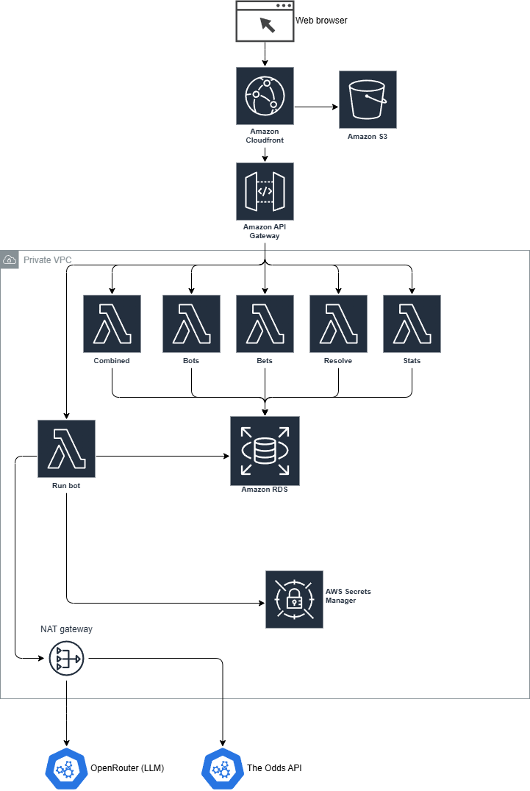

# BetBot Simulator

Plateforme de simulation de paris sportifs pilotée par LLM. Le bot récupère des cotes sportives en temps réel, les analyse via un modèle de langage, et décide de placer ou non un pari simulé selon le critère de Kelly.

## Architecture AWS



### Composants

**Frontend**
- **CloudFront + S3** — Hébergement du dashboard Next.js (CDN + HTTPS)

**Backend (VPC privé)**
- **API Gateway** — Point d'entrée unique pour toutes les requêtes API
- **Lambda Bots** — CRUD des bots et leurs stratégies
- **Lambda Bets** — CRUD des paris individuels
- **Lambda Combined** — Gestion des paris combinés
- **Lambda Resolve** — Résolution et mise à jour des paris
- **Lambda Stats** — Statistiques et performances
- **Lambda Run Bot** — Cœur du système : analyse LLM + décision Kelly
- **RDS PostgreSQL** — Base de données relationnelle (bots, paris, stats)
- **Secrets Manager** — Stockage sécurisé des clés API
- **NAT Gateway** — Accès internet sortant depuis le VPC

**APIs externes**
- **The Odds API** — Récupération des cotes sportives en temps réel
- **OpenRouter** — Passerelle LLM (Gemini, etc.)

### Décisions techniques

**RDS PostgreSQL plutôt que DynamoDB**
Le schéma de données est relationnel avec des foreign keys entre Bot, Bet, CombinedBet et CombinedBetLeg. DynamoDB aurait nécessité de tout repenser. Prisma ORM permet de garder le même code en changeant uniquement le provider de `sqlite` à `postgresql`.

**6 Lambdas distinctes plutôt qu'une Lambda unique**
Chaque Lambda correspond à une route API existante — la migration est naturelle. Chaque fonction a ses propres permissions IAM (principe du moindre privilège) : seule Run Bot accède à Secrets Manager.

**Déclenchement manuel plutôt qu'EventBridge**
Le run du bot et la résolution des paris sont déclenchés manuellement depuis le dashboard pour contrôler les coûts des APIs externes.

## Stack technique

| Couche | Technologie |
|--------|-------------|
| Frontend | Next.js, TypeScript, Three.js |
| ORM | Prisma |
| Base de données | PostgreSQL (RDS) |
| Runtime | Node.js (Lambda) |
| LLM | OpenRouter (Gemini 2.0 Flash) |
| Cotes | The Odds API |

## Fonctionnement

1. L'utilisateur crée un bot avec une stratégie (system prompt) et des paramètres (bankroll, Kelly max, edge minimum)
2. Il déclenche manuellement une analyse depuis le dashboard
3. Lambda Run Bot récupère les cotes disponibles via The Odds API
4. Les matchs sont envoyés par chunks au LLM via OpenRouter
5. Le LLM analyse chaque match et retourne une décision (BET/SKIP) avec une probabilité estimée
6. Le critère de Kelly calcule la mise optimale selon la bankroll et l'edge détecté
7. Les décisions sont stockées dans RDS et affichées sur le dashboard
8. L'utilisateur résout manuellement les paris une fois les matchs terminés

## Lancer le projet en local

```bash
npm install
npx prisma migrate dev
npm run dev
```

Variables d'environnement requises (`.env`) :

```
OPENROUTER_API_KEY=
ODDS_API_KEY=
DATABASE_URL=file:./dev.db
```

## Roadmap

- [x] Architecture locale (Next.js + SQLite)
- [ ] Migration RDS PostgreSQL
- [ ] Déploiement Lambdas + API Gateway
- [ ] Frontend sur S3 + CloudFront
- [ ] Infrastructure as Code (Terraform)